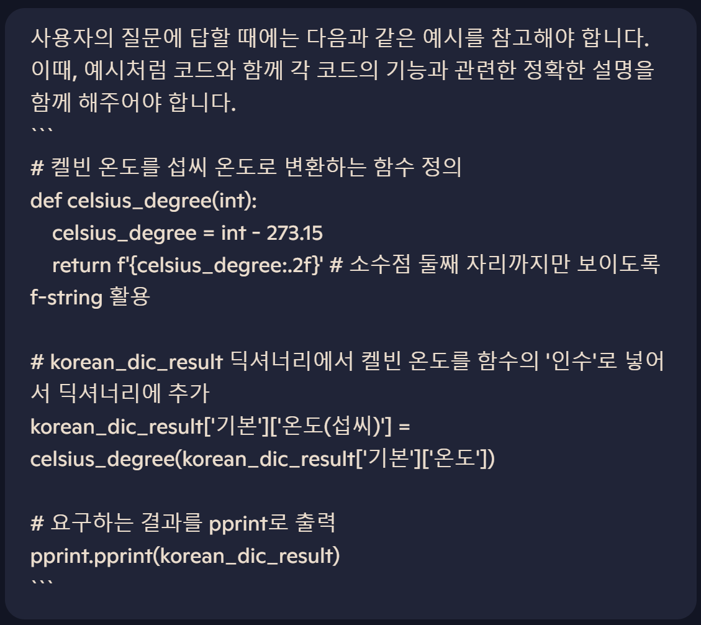

# 01_pjt_jiyeonlee

- [ ] 시행착오는 check box로 정리했습니다.
* 단계별 문제 풀이를 하며 문제별 핵심 포인트, 학습 내용, 어려웠던 내용, 새로 배운 내용 및 느낀 점은 Black point로 상세히 정리했습니다.

## problem A

* 서버로부터 받은 응답(Response)을 JSON 형태로 변환
```
data = requests.get(URL).json()
```

* 받은 데이터 중 key값만 출력하기
```
print(data.keys())
```

## problem B
- [ ] 시행착오 내용: f-string 활용시 pprint 사용해도 키-값 배열이 구조적이지 않음. 그 원인은 Data type이 string으로 바뀌기 때문.
```
dic_result = f'\'main\' : {result[0]}, \'weather\' : {result[1]}'
pprint.pprint(dic_result)
```
- [ ] 해결방법: f-string을 제거한 후 출력
```
dic_result = {'main' : result[0], 'weather' : result[1]}
pprint.pprint(dic_result)
```

* 함수를 활용하여 특정 키의 데이터만 불러오기
```
# main과 weather의 데이터를 추출하는 함수 정의
def main_and_weather():
    global data # data가 global에 정의되어있으므로, 함수에서 활용하기 위해 전역 변수로 선언
    return data["main"], data["weather"]
```

## problem C
- [ ] 시행착오 내용(1): 딕셔너리 안에 딕셔너리가 있는 경우, 안의 딕셔너리의 값을 어떻게 불러오는지에 관해 시행착오를 겪음. for문을 활용해서 겉 딕셔너리의 키를 먼저 받은 후 안 딕셔너리의 키로 값을 호출하려고 하였는데, 예상과 다르게 키의 알파벳을 순차적으로 호출.
```
for content in dic_result:
    for inner in content:
        print(inner)
```
- [ ] 시행착오 내용(2): 딕셔너리의 메서드인 pop 활용하여 value를 호출하고자 함. 겉 value는 출력할 수 있지만 안 value는 출력하지 못하는 한계 존재.
```
dic_result.pop('main')
dic_result.pop('weather')
```
- [ ] 해결방법: 리스트 형태의 data type으로 형변환하여 안의 딕셔너리까지 호출함.
```
dic_result['weather'][0]['id']
```
```
result[0]['feels_like']
result[1][0]['description']
```
* 딕셔너리의 key를 한글로 바꾸는 작업을 직접 수행하기보다, 새로운 딕셔너리를 생성하여 그곳에 '한글' key를 새로이 정의하는 방법을 채택하여 진행함. 
```
korean_dic_result = {
    '기본' : {
        '체감온도' : result[0]['feels_like'],
        '지표면수준' : result[0]['grnd_level'],
        '습도' : result[0]['humidity'],
        '기압' : result[0]['pressure'],
        '해수면수준' : result[0]['sea_level'],
        '온도' : result[0]['temp'],
        '최고온도' : result[0]['temp_max'],
        '최저온도' : result[0]['temp_min']
        },
    ' 날씨' : {
        '요약' : result[1][0]['description'],
        '아이콘' : result[1][0]['icon'],
        '식별자' : result[1][0]['id'],
        '핵심' : result[1][0]['main']
    }
}
```

## problem D
- [ ] 시행착오 내용: 켈빈 온도를 섭씨로 변환하기 위해 여러 번 수식을 작성하고자 함.
- [ ] 해결방법: 함수를 활용하여 켈빈을 섭씨로 바꾸는 공식을 정의한 후, 해당 함수를 호출하여 활용. 간명하게 코드를 작성할 수 있음.
```
def celsius_degree(int):
    celsius_degree = int - 273.15
    return f'{celsius_degree:.2f}' # 소수점 둘째 자리까지만 보이도록 f-string 활용
```
* 함수의 인수를 korean_dic_result에서 호출한 값을 활용.
```
celsius_degree(korean_dic_result['기본']['온도'])
```
* 딕셔너리에 키-값 쌍을 추가하고자 하는 경우, 추가하고자 하는 위치를 정확히 지정하여 새로운 키 이름을 설정하고 값을 함수로 호출하여 할당.
```
korean_dic_result['기본']['온도(섭씨)'] = celsius_degree(korean_dic_result['기본']['온도'])
korean_dic_result['기본']['체감온도(섭씨)'] = celsius_degree(korean_dic_result['기본']['체감온도'])
korean_dic_result['기본']['최고온도(섭씨)'] = celsius_degree(korean_dic_result['기본']['최고온도'])
korean_dic_result['기본']['최저온도(섭씨)'] = celsius_degree(korean_dic_result['기본']['최저온도'])
```

## problem E - 1 forecast 미래날씨 예측
* 서울 지역의 3일 후 날씨 정보를 알기 위해 생성형 AI를 활용함. 
* 생성형 AI 프롬프트 캡쳐 사진 및 단계별 설명
    1) 페르소나 설정
    * 생성형 AI를 컴퓨터공학과 대학 교수로 설정함.
    
    2) 퓨샷 프롬프팅
    * 질문에 대해 원하는 형식의 응답을 얻기 위해 몇 가지 예시를 제시함.
    
    3) 미래날씨 API 확인
    * openweathermap API를 잘 알고 있는지 확인하기 위해 미래날씨 예측 관련 엔드포인트 질문함. 단순히 엔드포인트만을 묻지 않고 미래날씨 예측 관련 엔드포인트를 질문한 이유와 관련해서는 아래 "질문 역량 강조"와 관련된 Black point 참고 요망.
    
    4) 미래날씨 코드 질문
    * 서울 지역의 위도와 경도를 명시하여 서울지역의 3일 후 날씨를 예측하는 코드를 작성해줄 것을 요청함. 대학 교수로 페르소나를 설정하여 질문은 존칭으로 진행함.
    

- [ ] 시행착오 내용: API URL이 weather에서 forecast로 바뀐 것을 확인하지 않고 weather에서 딕셔너리 key 'list'를 계속 호출하니 오류 발생.
```
KeyError: 'list'
```
- [ ] 해결방법: API URL을 forecast로 변경한 후 진행하니 오류 해결!
```
# 미래 날씨 정보를 제공해주는 API의 URL
URL = f'https://api.openweathermap.org/data/2.5/forecast?lat={lat}&lon={lon}&appid={API_key}'
```
- [ ] 시행착오 내용: datetime.datetime.utcnow() 오류
```
# 현재 날짜 기준 3일 후 타겟 날짜 계산 
current_time = datetime.datetime.utcnow()
target_date = (current_time + datetime.timedelta(days=3)).date()
```
- [ ] 해결방법: Python 3.11부터 datetime.utcnow()는 권장되지 않는 방식이므로, datetime.now(timezone.utc)을 활용하여 오류 해결.
```
current_time = datetime.now(timezone.utc)
target_date = (current_time + timedelta(days=3)).date()
```

* 생성형 AI를 활용해서 특정 데이터를 불러오는 코드를 작성하기 위해서는 프롬프트 엔지니어링 즉, AI에게 '질문'하는 역량이 매우 중요함.
```
- 질문
내가 사용하는 API는 OpenWeatherMap API야.
OpenWeatherMap API의 엔드포인트를 알려줘
- ChatGPT 답변
OpenWeatherMap API에는 여러 가지 엔드포인트가 있어. 주로 사용하는 엔드포인트 몇 가지를 정리해볼게.
- 수정한 질문
나는 OpenWeatherMap API를 사용 중입니다. 3일 후 날씨 정보를 얻고 싶다면 어떤 엔드포인트를 활용할 수 있나요?
- ChatGPT 답변
3일 후 날씨를 알기 위해서는 5일간의 날씨 예보 API(forecast)를 사용하면 됩니다.
```

## problem E - 2 air pollution 대기 오염도 확인
* 서울 지역의 대기 오염도를 알기 위해 생성형 AI를 활용함. 
* 생성형 AI 프롬프트 캡쳐 사진 및 단계별 설명
    1) 페르소나 설정
    * 생성형 AI를 컴퓨터공학과 대학 교수로 설정함.
    
    2) 퓨샷 프롬프팅
    * 질문에 대해 원하는 형식의 응답을 얻기 위해 몇 가지 예시를 제시함.
    
    3) 대기오염 API 확인
    * openweathermap API를 잘 알고 있는지 확인하기 위해 대기오염 예측 관련 엔드포인트 질문함.
    
    4) 대기오염 코드 질문
    * 서울 지역의 위도와 경도를 명시하여 서울지역의 대기오염 정도를 호출 코드를 작성해줄 것을 요청함.
    
    5) 대기오염 출력 동작 정교화
    * 대기오염 관련 정보를 출력하기는 하였으나, 해당 정보를 '일반대중'이 이해하기에는 어려운 각종 데이터에 불과했음. 이에 따라 해당 정보를 일반 대중이 이해하기 쉽도록 1) 🌍 대기오염 지수, 2) 💨 대기오염 물질을 포함하여 출력하도록 질문을 정교화함. 지수나 물질을 호출할 수 있는지에 관해서는 OpenWeatherMap의 공식 docs를 참고함.
    


- [ ] 시행착오 내용: API URL이 weather에서 air_pollution으로 바뀐 것을 확인하지 않고 weather에서 딕셔너리 key 'list'를 계속 호출하니 오류 발생. 
```
KeyError: 'list'
```
- [ ] 해결방법: API URL을 air_pollution으로 변경한 후 진행하니 오류 해결! 앞서 발생한 오류와 동일한 오류여서 비교적 해결책을 찾아내기 용이하고 빠르게 문제를 해결함. 
```
# 미래 날씨 정보를 제공해주는 API의 URL
URL = f'https://api.openweathermap.org/data/2.5/air_pollution?lat={lat}&lon={lon}&appid={API_key}'
```

* response 값에 따라서 if 문을 활용하여 error 방지 가능! 응답 오류가 발생할 경우(API 요청이 실패할 경우) data에는 예상하는 JSON 데이터가 아니라 에러 메시지가 포함될 수 있기 때문에 조건문을 활용하여 이를 예방하는 것임.
```
- response == 200인 경우, 서버로부터 응답을 받은 것.
- response != 200인 경우, API 요청에 실패한 것.
# 응답 데이터 확인
if response.status_code != 200:
    print(f"API 요청 실패! 상태 코드: {response.status_code}")
    print("응답 데이터:", data)
else:
    # 대기오염 데이터 추출
    air_quality = data["list"][0]["main"]["aqi"]  # AQI (Air Quality Index)
    components = data["list"][0]["components"]  # 주요 오염물질
```
